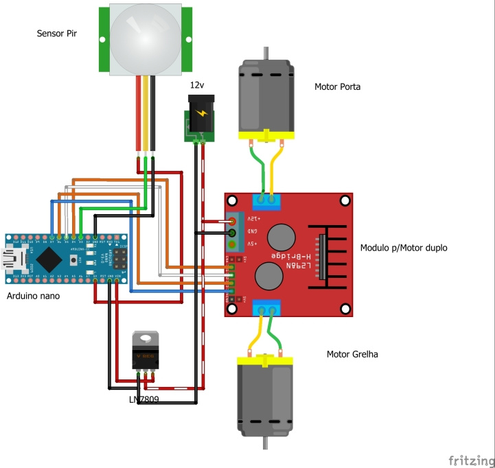
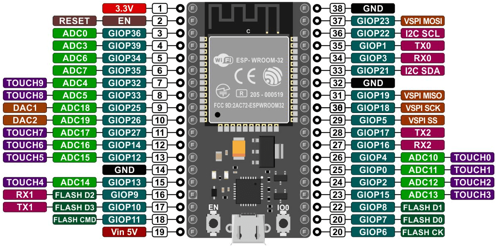
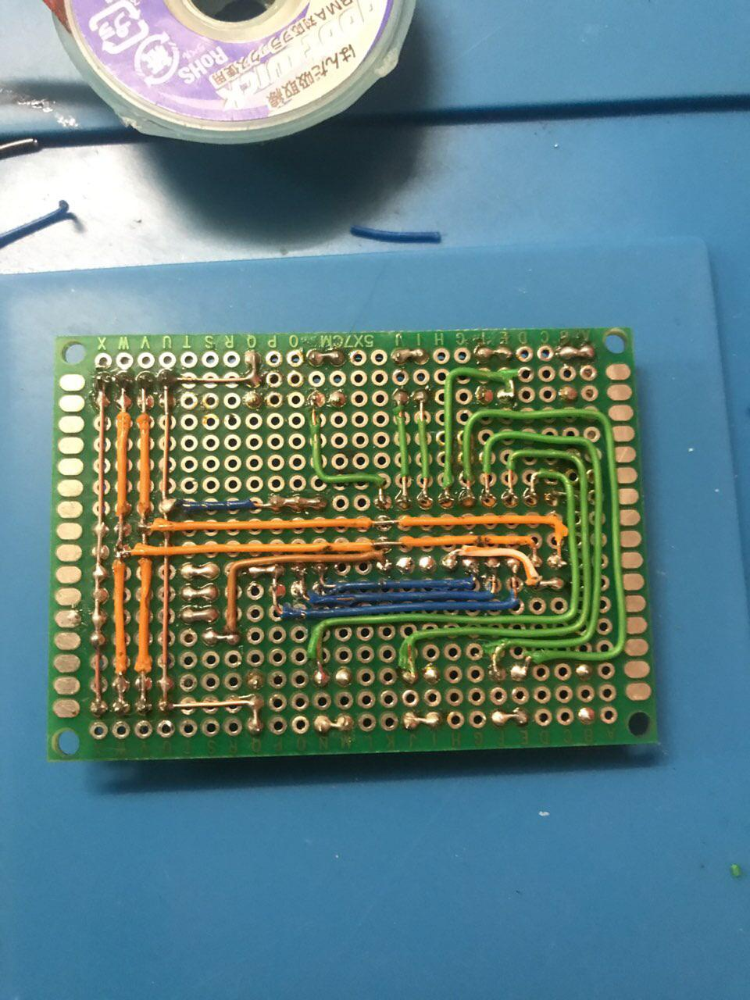
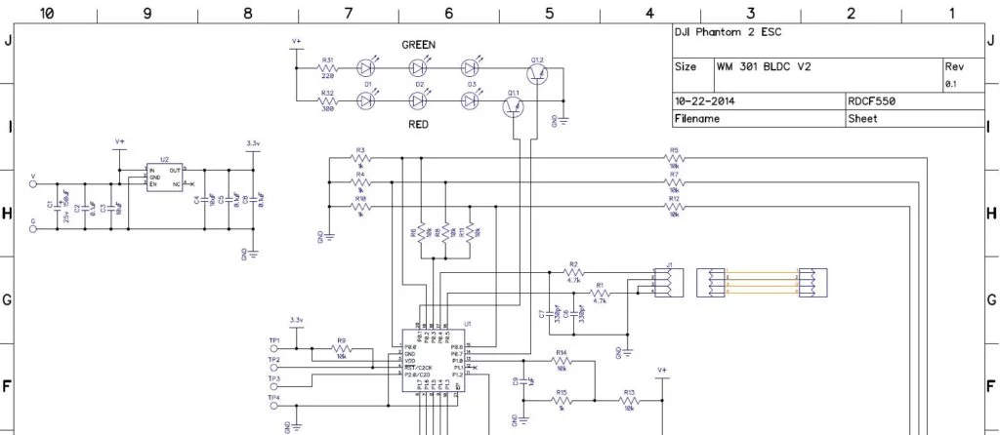
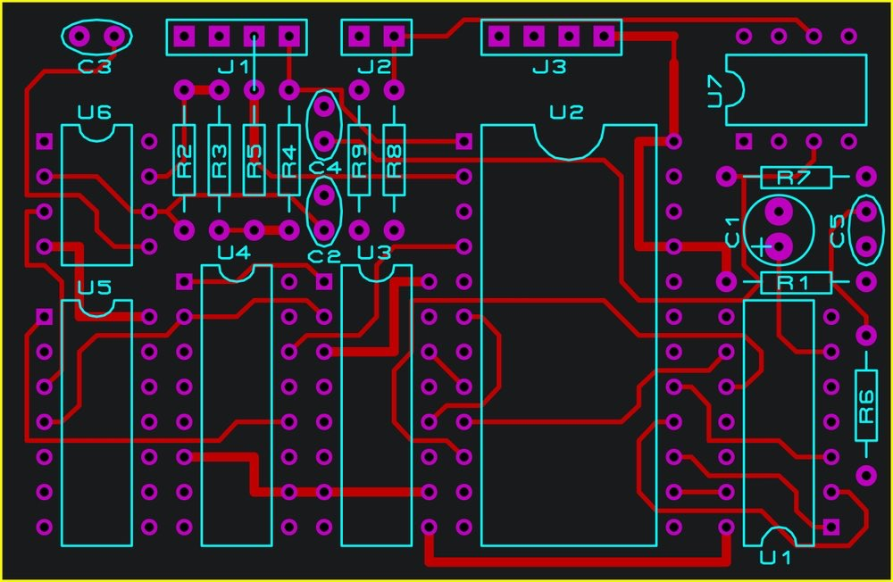

> *OBS: Este arquivo (README.md) deve ser excluído. Então mesmo que não tenha a seguir textos em itálico, este arquivo por completo deve ser excluído*

> *OBS 2: As imagens de exemplo devem ser apagadas*

---

# Diretório de Eletrônica

Para o desenvolvimento da Eletrônica não há um software específico que pode ser usado, fica à escolha de quem for desenvolver. Os mais comuns de serem usados são: Cirkit, Fritzing, Proteus, Altium, KiCad e EasyEDA.

Este diretório deve conter todos os arquivos relacionados ao projeto eletrônico do robô, neste diretório deve ter:

- Diagrama de conexão. Ex:

> *O diagrama de conexão é para que a conexão dos componentes físicos seja feita de maneira mais prática, é ideal para saber exatamente quais componentes são necessários e sua localização na placa*

- Diagramas de pinout. Ex:

> *O diagrama de pinout é para ficar mais evidente como os pinos dos componentes estão ligados entre si, então haverá um diagrama desse para para componente com vários pinos, como o Microcontrolador, Ponte H, Sensores, etc*

- Fotos da placa. Ex:

> *É recomendado sempre registrar as versões da placa para que depois seja possível observar a evolução ao longo do desenvolvimento*

- (OPCIONAL) Esquemáticos eletrônicos. Ex:

> *O esquemático eletrônico servirá para quem for fazer a PCB ou quem for querer fazer simulações mais precisas do circuito*

- (OPCIONAL) Layout de PCB. Ex:

> *Layout da placa de circuito impresso (PCB)*

## Estrutura

- `design/`: Diretório contendo o design e diagramas da placa, em PDF ou formato de imagem. Exemplo:
  - Diagrama de conexão
  - Diagramas de pinout

- `img/`: Diretório contendo fotos das versões da placa real.

- (OPCIONAL) `pcb/`: Diretório contendo os arquivos necessários para fazer a placa de circuito impresso, como Esquemático Eletrônico e arquivo Gerber.